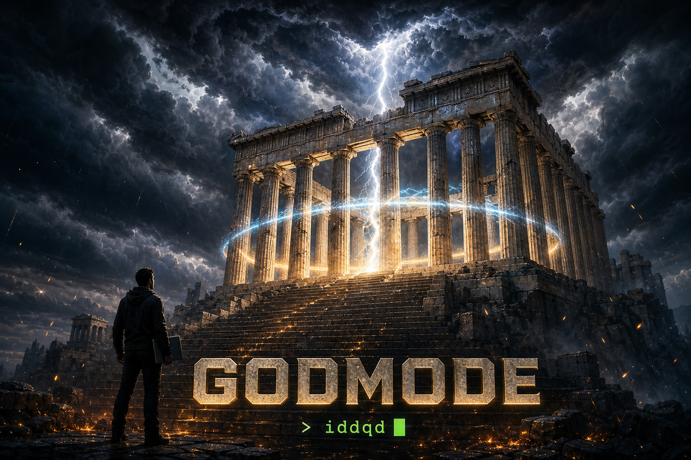

[English](README.md) | 한국어 | [中文](README.zh.md) | [日本語](README.ja.md) | [Español](README.es.md)

# godmode

<div align="center">
   iddqd' cheat code">
</div>

```
> iddqd

GOD MODE ON.
무적 모드 발동.
이제 당신의 아이디어는 출시 전에 죽을 수 없습니다.
```

> **끝내기 치트키.** 켜고, 아이디어를 던지면, 문서가 스스로 "완성"이라고 말할 때까지 루프가 멈추지 않습니다.

모든 프로젝트는 똑같이 죽습니다: 80% 완성, 0% 출시. godmode는 "죽는다"는 선택지를 제거합니다. 인터뷰 → PRD → 골 셋업 → `/goal` 실행을 연결한 뒤, **검증 → 리뷰 → 개선** 사이클을 완성 정의(DoD)에 도달할 때까지 계속 돌립니다 — **VALIDATION 전체 통과 AND blocking 가정 0**. 진행이 막히면 포기 대신 접근을 바꾸는 리커버리 사다리가 발동하고, 조기 종료는 드리븐 가드가 잡아서 루프에 다시 던져 넣습니다.

계속할지 물어보지 않습니다. 그게 핵심입니다.

## Quick Start

### 1. 마켓플레이스 추가

```
/plugin marketplace add fivetaku/godmode
```

### 2. 설치

```
/plugin install godmode@godmode
```

### 3. 치트키 입력

```
/godmode 일찍 그만두면 나를 부끄럽게 만드는 뽀모도로 타이머 만들어줘
```

끝. 완성되면 알려줍니다. (완성 판정은 기분이 아니라 문서가 합니다.)

## 갓모드의 규칙

1. **완성은 느낌이 아니라 정의다.** DoD = VALIDATION 전체 통과 + blocking 가정 0. 문서에 적히고, 루프가 검사한다.
2. **조기 종료는 없다.** 정체 → 재시도 → 더 깊은 리뷰어로 접근 변경 → 재계획 게이트. 사다리에 "포기"는 없다.
3. **한방 완성이 아니라 미세 루프.** 각 단계는 "시작하기 충분한" 수준으로 빠르게 통과시키고, 루프가 품질을 조인다.
4. **리뷰어는 갈아끼운다.** self-review(기본) / insane-review / codex / gjc — 심판은 당신이 고른다.

## 요구사항

- [Claude Code](https://claude.com/claude-code)
- [gptaku-plugins](https://github.com/fivetaku/gptaku_plugins) 파이프라인(`show-me-the-prd`, `goaljaby`)이 설치되어 있으면 godmode가 이를 오케스트레이션합니다.

## 혈통

godmode는 [insane-loop](https://github.com/fivetaku/insane-loop)의 밈 에디션입니다 — 같은 엔진, 더 뻔뻔한 태도.

## 라이선스

MIT — [LICENSE](LICENSE)와 [DISCLAIMER](DISCLAIMER.md) 참고. 갓모드는 은유입니다. 출시물에 대한 책임은 여전히 당신에게 있습니다.
